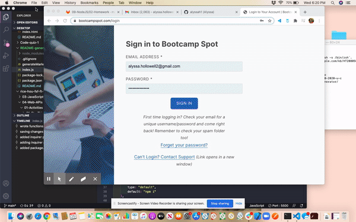

# Readme Generator 

# Project Name
project 1

# Description
shopping dashboard

#Table of Contents
*[Project Name](#ProjectName)
*[Project Description](#Description)
*[License](#License)
*[Installation](#Installation)
*[Run tests](#Runtests)
*[Using Repo](#UsingRepo)
*[Contribute to repo](#Contributetorepo)
*[Questions](#Questions)

# License
MIT

# Installation
npm i

# Run tests
npm test

# Using Repo
fork before you do anything

# Contributing to repo
pull request only

# Demo/Screenshot

# Quesitons
If you have any questions please use the contacts down below:

#### Email address: alyssa.hollowell2@gmail.com
#### GitHub account: alyssah1

